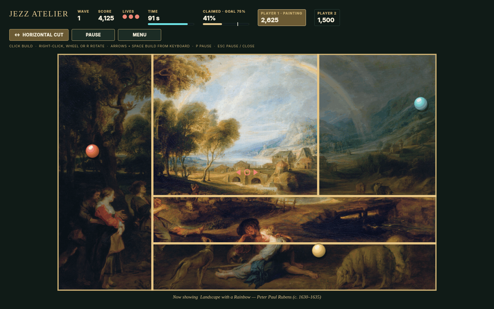

# Jezz Atelier



Jezz Atelier is a single-player, offline JezzBall-inspired game for Omarchy. Settle into an ASMR-inspired, relaxing rhythm with Bach piano recordings and soft collision sounds as you draw cuts around bouncing spheres. Blurry, noisy paintings come into focus as you enclose regions; Relaxed mode offers gentler pacing.

## Features

- Single-player play in Relaxed, Classic, and Expert modes.
- Paintings start blurred and grainy; claimed regions sharpen over 2.6 seconds (instantly with reduced motion).
- Vertical and horizontal cuts, with an on-board cursor that shows the current orientation.
- Lacquered spheres that bounce off the walls and off each other, with impact sounds.
- Ten public-domain paintings, ten classical piano performances of Bach by Kimiko Ishizaka, original sound effects, a painting gallery, and brightness and volume settings.
- Local high scores and preferences; keyboard-only or pointer-only play; pause and reduced-motion option.
- Layout that adapts to ultrawide screens by moving the HUD to a side panel.

## Requirements and installation

Omarchy with shell plugins (tested on package `omarchy 4.0.4-1`) and Qt 6.11. QtMultimedia is optional: the game runs silently without it. Review the source before enabling: plugins run **unsandboxed** in the shared shell process with your user permissions.

```sh
omarchy plugin add https://github.com/julianbruno/jezzatelier.git --enable
```

Summon the overlay with:

```sh
omarchy-shell shell summon io.github.julianbruno.jezz-atelier '{}'
```

To list Jezz Atelier with its own icon under **Apps** in the Omarchy menu, run this once after adding the plugin (the default `SUPER + SPACE` opens the menu, not a separate app search):

```sh
~/.config/omarchy/plugins/io.github.julianbruno.jezz-atelier/scripts/install-launcher.sh
```

It writes one desktop entry and one icon under `~/.local/share`; `install-launcher.sh --remove` takes them away. Omarchy plugins have no install hooks, so this step is opt-in.

**Optional:** add a shortcut to `~/.config/hypr/bindings.lua` (choose an unused key; `SUPER + J` is taken by default):

```lua
o.bind("SUPER + SHIFT + J", "Jezz Atelier", "omarchy-shell shell toggle io.github.julianbruno.jezz-atelier '{}'")
```

The shell IPC contract accepts `summon <id> <payloadJson>`, `toggle <id> <payloadJson>`, and `hide <id>`; the wrapper also supplies `{}` if the third summon/toggle argument is omitted. Escape pauses during play; from a paused dialog it closes the overlay.

## Controls

| Action | Pointer | Keyboard |
| --- | --- | --- |
| Aim | Move over board | Arrow keys; Shift + arrows for faster movement |
| Build wall / confirm dialog | Left click / button | Space or Enter |
| Switch vertical ↕ / horizontal ↔ cut | Right click, mouse wheel, or the cut button | R |
| Pause / resume | Pause / Resume button | P |
| Open the menu (pauses the game) | Menu button | — |
| Pause, or close from a dialog | — | Escape |

## How to play

Place a horizontal or vertical wall inside open space while avoiding the moving spheres, which bounce off the walls and off each other. Both ends grow outward; if a sphere hits the unfinished wall, you lose a life. When the wall completes, any resulting region without a sphere is claimed: that part of the painting comes into focus and you earn points. Reach the coverage target before time or lives run out to advance to the next wave; remaining time and lives earn a bonus.

## Update, disable, remove

```sh
omarchy plugin update io.github.julianbruno.jezz-atelier
omarchy plugin disable io.github.julianbruno.jezz-atelier
omarchy plugin remove io.github.julianbruno.jezz-atelier
```

After an update, run `omarchy restart shell`: the running shell keeps the previously loaded game code until it restarts. See the [local install and release guide](docs/local-install-and-release.md) for the installed-checkout workflow and optional launcher removal.

Before removing the plugin, run `scripts/install-launcher.sh --remove` if you added the launcher entry. Removal disables the plugin and removes its git checkout; it does **not** clear your saved scores/settings. Update previews the diff and requires a clean fast-forward checkout. Re-enable with `omarchy plugin enable io.github.julianbruno.jezz-atelier`.

## Data, privacy, and security

Preferences and local high scores are saved at `${XDG_STATE_HOME:-$HOME/.local/state}/jezz-atelier/state.json`. To reset, first disable/close the plugin, then delete **only that file** yourself; the next launch uses defaults. The game makes no network requests at runtime, runs no external executables, and uses no accounts or telemetry. It reads bundled assets and its own state file; as an unsandboxed plugin it nevertheless has your user's permissions in the shared shell process. See [SECURITY.md](SECURITY.md).

## Compatibility and development

Designed for the Omarchy overlay plugin contract; tested against Omarchy package `4.0.4-1` and Qt 6.11. Other shell versions and live launcher search, focus, and audible playback need independent testing. The public repository is [julianbruno/jezzatelier](https://github.com/julianbruno/jezzatelier); this documentation does not imply that current local changes have been pushed or submitted to the marketplace. Run `scripts/validate.sh` for Qt 6 offscreen tests, lint, manifest, media and hygiene checks, and `scripts/smoke-lifecycle.sh` for an isolated install/update/remove run. To rebuild media (network, Node, Python, ImageMagick and ffmpeg required), use `scripts/build-media.sh`, then `scripts/generate-notices.sh` and validate. See [CONTRIBUTING.md](CONTRIBUTING.md).

## Credits and license

Jezz Atelier is inspired by [JezzBall](https://en.wikipedia.org/wiki/JezzBall), the classic territory-claiming game. This is an independent interpretation, not an official JezzBall release.

Original code and associated documentation: Julian Bruno, MIT ([LICENSE](LICENSE)). Bundled media is outside MIT: project-made sound effects are dedicated under CC0 1.0, third-party piano recordings are CC0, and paintings are public domain. Full credits, source links, and license details are in [THIRD_PARTY_NOTICES.md](THIRD_PARTY_NOTICES.md).

<p align="center">
  <a href="https://github.com/Gentleman-Programming/gentle-ai"></a><br>
  JezzAtelier is crafted with Gentle-AI
</p>
